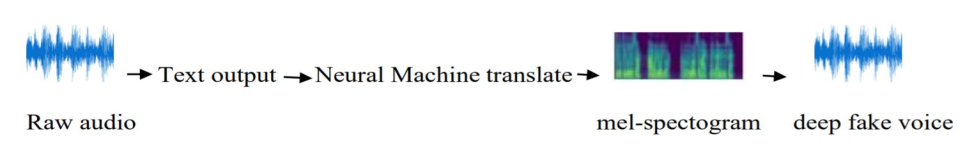

# *Podcasts Deepfake Audio with Multilingual Representation*
## ECE 657 [Tools of Intelligent Systems Design] Project

## Overview

- Making the same podcasts content reachable to all diversities of people with their
favorite “artistic voice and language”
- Convolutional Neural Networks, NLP and GAN’s are key building blocks of the model
- Three key stages involved, first the raw audio to text conversion, second language modelling and third inversion back to audio

### Block diagram of the system

